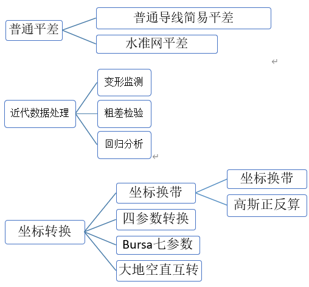
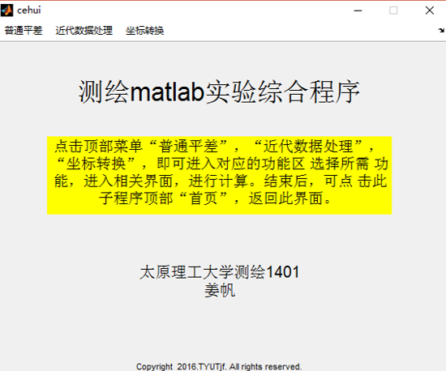
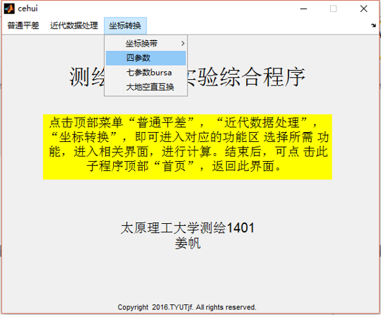
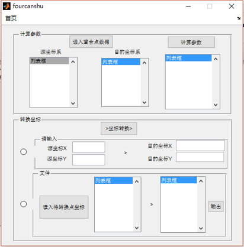

# 测绘常用程序工具包
本科期间完成

主要包含大地测量坐标系，地理坐标系，投影坐标系的转换工具；   
简易导线平差与水准网平差程序；  
沉降秩亏自由网平差，粗差探测；    

-------------------------
各个功能模块：

    

界面为：

    

比如选择菜单栏“坐标转换-四参数”:  

    

弹出四参数坐标转换程序：  

    

点击菜单“首页”，返回初始界面。

